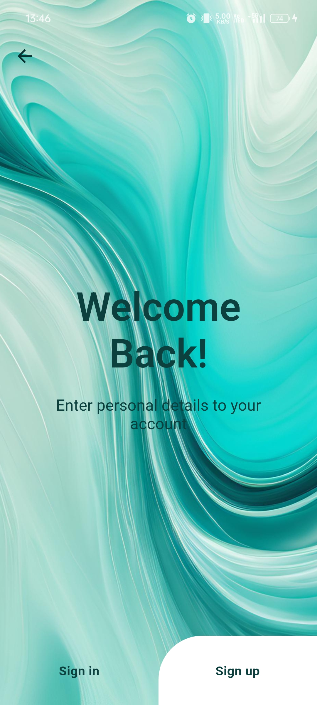

# AquaSave - Smart Water Management System

A real-time water monitoring and management mobile application powered by IoT technology.

## Overview

AquaSave is an intelligent water management solution that combines IoT hardware with a mobile app to help users monitor their water consumption, detect leaks, and manage water usage efficiently. The system leverages ESP32 microcontroller integration with flowmeters and solenoid valves to provide comprehensive water management capabilities.

## Key Features

### 📊 Real-time Monitoring
- Live water flow rate tracking
- Total consumption metrics
- Multi-room usage monitoring
- Usage patterns and trends

### 🚰 Leak Detection
- Automated leak detection system
- Instant alert notifications
- Historical leak data analysis
- Preventive maintenance insights

### 📱 Smart Controls
- Remote valve operation
- Automated emergency shutoff
- Room-specific management
- Scheduling capabilities

### 📈 Usage Analytics
- Daily/weekly/monthly reports
- Consumption visualization
- Comparative usage analysis
- Cost optimization insights

### 💰 Billing Management
- Automated calculations
- Payment tracking
- Usage-based breakdown
- Historical billing data

## Technology Stack

### Mobile Application
- **Frontend**: Flutter
- **Backend**: Firebase Realtime Database
- **Authentication**: Firebase Auth
- **Notifications**: Firebase Cloud Messaging

### IoT Components
- ESP32 Microcontroller
- Water Flow Meters
- Solenoid Valves
- Sensor Integration

## App Screenshots

### Login & Authentication

<em>Secure authentication with email and password login</em>

### Dashboard

<em>Real-time water usage monitoring and system status</em>

### Analytics

<em>Detailed consumption trends and usage patterns</em>

### Leak Detection

<em>Active leak monitoring and alert system</em>

### Billing

<em>Usage-based billing and payment tracking</em>

### Settings

<em>App configuration and user preferences management</em>

---
*Built with Flutter & IoT Technology*
